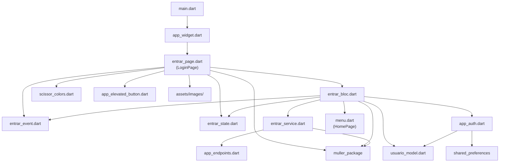

# Estrutura de tela — Covertix Gestor Web

Este documento descreve **como uma tela é organizada no projeto** e **quais arquivos participam dela**, usando a feature de login (`lib/pages/login_page/`) como referência. O foco é arquitetura e responsabilidades de cada arquivo, não o comportamento visual ou de negócio da tela.

---

## Visão geral

O projeto segue um padrão por **feature** (pasta por funcionalidade), com separação em camadas:

| Camada | Responsabilidade |
|--------|------------------|
| **Entrada do app** | Inicializa o Flutter e define a rota inicial |
| **Página (`*_page.dart`)** | Widget `StatefulWidget`: layout, formulários locais, escuta do BLoC |
| **BLoC (`*_bloc.dart`)** | Orquestra eventos, estados, chamadas de serviço e efeitos colaterais (navegação, snackbar, persistência) |
| **Event (`*_event.dart`)** | Ações disparadas pela UI para o BLoC |
| **State (`*_state.dart`)** | Representação dos estados da UI (inicial, loading, sucesso, erro) |
| **Service (`*_service.dart`)** | Chamadas HTTP isoladas (endpoints + body) |
| **Model** | Tipagem e serialização dos dados da API |
| **Config** | Rotas iniciais, endpoints, cores do app, autenticação persistida |
| **Widgets compartilhados** | Componentes reutilizáveis específicos do Scissor |
| **Pacote externo** | UI base, HTTP, strings, navegação (`muller_package`) |

---

## Diagrama de dependências (login)



---

## Árvore de arquivos da feature de login

```
lib/
├── main.dart                          # Ponto de entrada
├── app_config/
│   ├── app_widget.dart                # MaterialApp e tela inicial
│   ├── app_auth.dart                  # Token e usuário em SharedPreferences
│   └── const/
│       ├── app_endpoints.dart         # URL do login-web
│       └── scissor_colors.dart        # Paleta do projeto
├── models/
│   └── usuario_model.dart             # Modelo retornado pelo login
├── pages/
│   ├── login_page/
│   │   ├── entrar_page.dart           # UI (classe LoginPage)
│   │   ├── entrar_bloc.dart
│   │   ├── entrar_event.dart
│   │   ├── entrar_state.dart
│   │   └── entrar_service.dart
│   └── menu.dart                      # Destino após login (HomePage)
└── widgets/
    └── app_elevated_button.dart       # Botão estilizado do Scissor

assets/images/
├── logo/logo.png                      # Asset referenciado na página
└── background.png                     # Asset referenciado na página

pubspec.yaml                           # Dependências e declaração de assets
```

---

## Papel de cada arquivo

### Entrada e configuração global

| Arquivo | Função na estrutura |
|---------|---------------------|
| `lib/main.dart` | Executa `runApp(AppWidget())`. Não conhece a feature de login diretamente. |
| `lib/app_config/app_widget.dart` | Monta o `MaterialApp`, define `navigatorKey` global e **`home: LoginPage`**. É o elo entre o app e a primeira tela. |
| `pubspec.yaml` | Declara `flutter_bloc`, `bloc`, `shared_preferences`, `muller_package` e pastas em `flutter.assets` usadas pela página. |

### Camada da feature (`login_page/`)

| Arquivo | Função na estrutura |
|---------|---------------------|
| `entrar_page.dart` | **Camada de apresentação.** `StatefulWidget` (`LoginPage`) que instancia o BLoC, monta o `scaffold`/`BlocBuilder`, cria `AppFormField` no `initState`, valida o `Form` e dispara `EntrarLoginEvent`. Não chama HTTP diretamente. |
| `entrar_bloc.dart` | **Orquestrador.** Registra handler `on<EntrarLoginEvent>`, emite estados (`Loading` → `Success`/`Error`), chama `loginWeb`, persiste sessão via `app_auth`, exibe feedback (`showSnackbarSuccess`) e navega com `open(screen: HomePage())`. |
| `entrar_event.dart` | **Contrato de entrada do BLoC.** Evento concreto `EntrarLoginEvent` com `email` e `senha`. |
| `entrar_state.dart` | **Contrato de saída do BLoC.** Estados `Initial`, `Loading`, `Success`, `Error`; classe base carrega `ErrorModel` e `UsuarioModel` para o `BlocBuilder` na página. |
| `entrar_service.dart` | **Camada de rede da feature.** Função `loginWeb` que usa `postHTTP` do pacote Muller e `AppEndpoints.endpointLoginWeb`. |

### Suporte transversal (usados pelo login, não exclusivos da pasta)

| Arquivo | Função na estrutura |
|---------|---------------------|
| `lib/app_config/const/app_endpoints.dart` | Constante `endpointLoginWeb` consumida pelo service. |
| `lib/app_config/app_auth.dart` | `saveToken`, `saveUsuarioLogado`, `getToken`, `getUsuarioLogado`, `clearToken` — sessão usada após sucesso no BLoC e no logout em `menu.dart`. |
| `lib/models/usuario_model.dart` | `fromMap` / `empty()` para desserializar a resposta do login e popular estados. |
| `lib/app_config/const/scissor_colors.dart` | Cores de marca usadas na página (`primary`, `white`). |
| `lib/widgets/app_elevated_button.dart` | Wrapper `appElevatedButtonScissor` sobre helpers do `muller_package`. |
| `lib/pages/menu.dart` | `HomePage` — tela de shell pós-login; também importa `LoginPage` para logout (`open(screen: LoginPage())`). |

### Recursos estáticos

| Recurso | Declaração | Uso na estrutura |
|---------|------------|------------------|
| `assets/images/logo/logo.png` | `pubspec.yaml` → `assets/images/logo/` | Referência em `Image.asset` na página |
| `assets/images/background.png` | `pubspec.yaml` → `assets/images/` | Referência em `AssetImage` na página |

### Dependência externa: `muller_package`

Pacote Git (`pubspec.yaml`). Na estrutura de tela do login, fornece (entre outros):

- Layout: `scaffold`, `appContainer`, `appSizedBox`, `appText`, `appTextButton`, `appLoading`
- Formulário: `AppFormField`
- Design system: `AppColors`, `AppStrings`, `AppSpacing`, `AppRadius`
- HTTP: `postHTTP`, `AppResponse`, `ApiException`
- Erro: `ErrorModel`
- Navegação: `open`, `AppContext.navigatorKey`
- Feedback: `showSnackbarSuccess`

A página e o BLoC **dependem fortemente** desse pacote; mudanças nele impactam todas as telas que seguem o mesmo padrão.

---

## Fluxo de dados (estrutural)

1. **Bootstrap:** `main` → `AppWidget` → exibe `LoginPage`.
2. **Interação:** `LoginPage` valida formulário localmente e envia `bloc.add(EntrarLoginEvent(...))`.
3. **BLoC:** emite `EntrarLoadingState` → chama `entrar_service.loginWeb` → trata resposta/erro.
4. **Sucesso:** `UsuarioModel.fromMap` → `app_auth` persiste → emite `EntrarSuccessState` → `open(HomePage)`.
5. **Erro:** emite `EntrarErrorState` com `ErrorModel` → `BlocBuilder` na página reage ao tipo de estado.
6. **UI reativa:** `BlocBuilder<EntrarBloc, EntrarState>` alterna entre widget de loading e formulário (com `errorModel` opcional).

---

## Convenção para outras telas do projeto

Telas administrativas (ex.: `lib/pages/menu_admin/usuarios/`) repetem o **mesmo esqueleto**:

| Sufixo / arquivo | Equivalente no login |
|------------------|----------------------|
| `*_page.dart` | `entrar_page.dart` |
| `*_bloc.dart` | `entrar_bloc.dart` |
| `*_event.dart` | `entrar_event.dart` |
| `*_state.dart` | `entrar_state.dart` |
| `*_service.dart` | `entrar_service.dart` |

Diferenças estruturais comuns em relação ao login:

- **Listagem + cadastro:** além da `*_page.dart`, pode existir `*_cadastro.dart` (segunda tela na mesma pasta), aberta com `open(screen: ...)`.
- **Shell:** telas internas ficam embutidas em `HomePage` via `menu_config.dart`, não como `home` do `MaterialApp`.
- **Widgets extras:** tabelas (`lib/widgets/table/`), `app_loading.dart`, etc., conforme a feature.

---

## Checklist — arquivos ao criar uma nova tela

Use como modelo a pasta `login_page/`:

1. [ ] `lib/pages/<feature>/<nome>_page.dart` — `StatefulWidget` + `BlocBuilder`
2. [ ] `lib/pages/<feature>/<nome>_bloc.dart` — handlers `on<Event>`
3. [ ] `lib/pages/<feature>/<nome>_event.dart` — eventos
4. [ ] `lib/pages/<feature>/<nome>_state.dart` — estados
5. [ ] `lib/pages/<feature>/<nome>_service.dart` — funções HTTP
6. [ ] Endpoint em `app_endpoints.dart` (se nova rota API)
7. [ ] Model em `lib/models/` (se novo payload)
8. [ ] Widgets em `lib/widgets/` (se componente novo e reutilizável)
9. [ ] Cores em `scissor_colors.dart` (se cor de marca nova)
10. [ ] Assets em `assets/` + entrada em `pubspec.yaml`
11. [ ] Navegação: `open(...)` no BLoC ou registro em `menu_config.dart` para telas do painel
12. [ ] `app_auth.dart` / headers (se a tela exige sessão)

---

## Mapa rápido: login → arquivo

| Responsabilidade estrutural | Arquivo |
|----------------------------|---------|
| Iniciar app | `lib/main.dart` |
| Definir tela inicial | `lib/app_config/app_widget.dart` |
| UI e formulário | `lib/pages/login_page/entrar_page.dart` |
| Lógica e navegação pós-ação | `lib/pages/login_page/entrar_bloc.dart` |
| Ações do usuário → BLoC | `lib/pages/login_page/entrar_event.dart` |
| Estados para o builder | `lib/pages/login_page/entrar_state.dart` |
| POST login-web | `lib/pages/login_page/entrar_service.dart` |
| URL da API | `lib/app_config/const/app_endpoints.dart` |
| Sessão local | `lib/app_config/app_auth.dart` |
| DTO usuário | `lib/models/usuario_model.dart` |
| Botão Scissor | `lib/widgets/app_elevated_button.dart` |
| Cores | `lib/app_config/const/scissor_colors.dart` |
| Próximo shell | `lib/pages/menu.dart` |
| UI/HTTP/navegação compartilhada | `muller_package` (dependência) |
| Imagens | `assets/images/` + `pubspec.yaml` |

---

## Referência cruzada

- Padrão BLoC: pacotes `bloc` e `flutter_bloc` em `pubspec.yaml`
- Documentação do repositório geral: `README.md` na raiz do projeto
