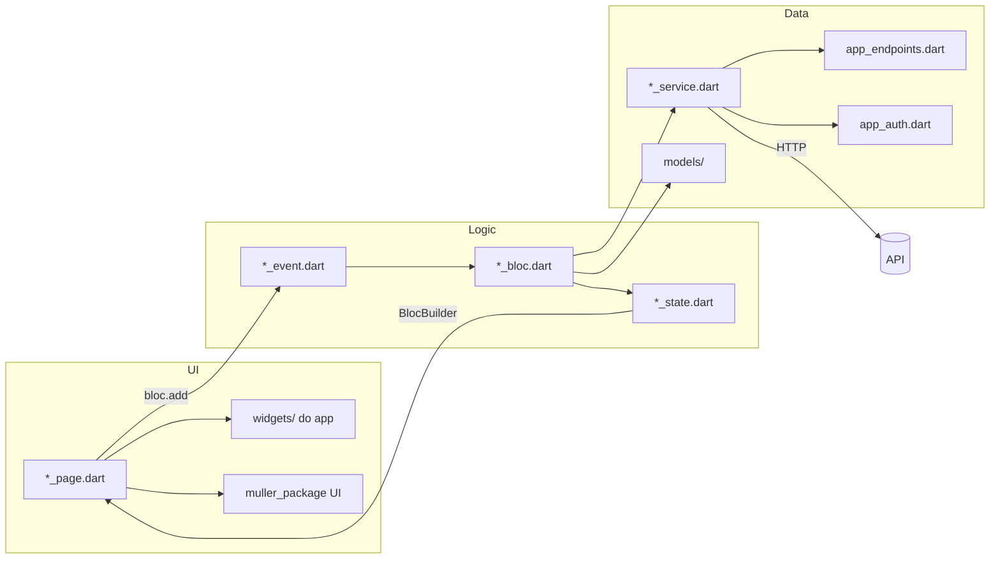

# Padronização e estrutura de código — Covertix Gestor Web

Guia de referência para organizar um projeto Flutter com **BLoC**, **`muller_package`** (pacote compartilhado) e **widgets específicos do app**. Use este documento como modelo ao iniciar ou alinhar outro repositório.

---

## 1. Princípios gerais

| Princípio | Descrição |
|-----------|-----------|
| **Feature por pasta** | Cada funcionalidade vive em `lib/pages/<feature>/` com arquivos fixos (`*_page`, `*_bloc`, `*_event`, `*_state`, `*_service`). |
| **UI não chama API** | A página dispara eventos; o BLoC chama o service; o service faz HTTP. |
| **Pacote = genérico** | Tudo que serve a vários apps fica no `muller_package`. |
| **Projeto = marca e domínio** | Cores da marca, tabelas administrativas, botões com identidade visual e validações específicas ficam no app. |
| **StatefulWidget na página** | Formulários (`AppFormField`), `initState`, `BlocBuilder`/`BlocConsumer` e layout ficam na `*_page.dart`. |
| **BLoC sem BuildContext** | Navegação global (`open`), snackbar e persistência são chamados no BLoC via helpers do pacote. |

---

## 2. Estrutura de pastas

```
lib/
├── main.dart                          # runApp(AppWidget())
├── app_config/
│   ├── app_widget.dart                # MaterialApp, navigatorKey, home inicial
│   ├── app_auth.dart                  # Token e usuário (SharedPreferences)
│   ├── menu_config.dart               # Itens do menu lateral por perfil
│   └── const/
│       ├── app_endpoints.dart         # URLs da API
│       └── covertix_colors.dart       # Cores exclusivas do app (marca)
├── models/                            # DTOs: fromMap/fromJson, empty(), toMap/toJson*
├── function/                          # Validadores e helpers só do app
│   └── validators.dart
├── pages/
│   ├── login_page/                    # Feature standalone (fora do menu)
│   │   ├── entrar_page.dart
│   │   ├── entrar_bloc.dart
│   │   ├── entrar_event.dart
│   │   ├── entrar_state.dart
│   │   └── entrar_service.dart
│   ├── menu.dart                      # Shell pós-login (HomePage)
│   └── menu_admin/
│       └── <feature>/
│           ├── <feature>_page.dart    # Listagem
│           ├── <feature>_cadastro.dart # Formulário (opcional)
│           ├── <feature>_bloc.dart
│           ├── <feature>_event.dart
│           ├── <feature>_state.dart
│           └── <feature>_service.dart
└── widgets/                           # Componentes visuais do app (não genéricos)
    ├── app_elevated_button.dart
    ├── app_loading.dart
    ├── card.dart
    ├── empty.dart
    ├── util.dart
    └── table/
        ├── table.dart
        ├── table_cell.dart
        ├── table_header.dart
        └── table_breakpoint_scope.dart

assets/
├── images/
└── json/

docs/                                  # Documentação do projeto
```

---

## 3. Dependência do `muller_package`

O pacote fica **no mesmo diretório pai** do app (monorepo local):

```
projects/flutter/
├── muller_package/
└── web_gestor_site_covertix/  # ou outro app
```

No `pubspec.yaml` do app, use **path** (não Git) para desenvolvimento local:

```yaml
dependencies:
  muller_package:
    path: ../muller_package

  bloc: ^8.1.4
  flutter_bloc: ^8.1.6
  shared_preferences: ^2.2.3
```

Import padrão nas telas:

```dart
import 'package:muller_package/muller_package.dart';
```

Import granular (quando quiser evitar o barrel) — usado em `empty.dart`:

```dart
import 'package:muller_package/app_components/app_text.dart';
import 'package:muller_package/app_consts/app_colors.dart';
```

---

## 4. Divisão: `muller_package` vs widgets do projeto

### 4.1 O que fica no `muller_package`

| Categoria | Exemplos | Uso |
|-----------|----------|-----|
| **Layout base** | `scaffold`, `appContainer`, `appSizedBox`, `appText`, `appTextButton` | Estrutura de qualquer tela |
| **Formulário** | `AppFormField`, `AppFormFormatters` | Campos de texto com validação |
| **Botões genéricos** | `appElevatedButtonText` | Base sem identidade visual do app |
| **Design system** | `AppColors`, `AppSpacing`, `AppRadius`, `AppFontSizes`, `AppStrings` | Tokens compartilhados entre apps |
| **HTTP** | `getHTTP`, `postHTTP`, `deleteHTTP`, `AppResponse`, `ApiException` | Camada de rede |
| **Erro** | `ErrorModel`, `appError` | Tratamento padronizado |
| **Navegação** | `open`, `AppContext.navigatorKey` | Push sem `BuildContext` no BLoC |
| **Feedback** | `showSnackbarSuccess`, `showSnackbarWarning`, `showSnackbarError` | Mensagens ao usuário |
| **Utilitários** | `formataCPF`, `formataCelular`, `validaEmail`, `validaCPF`, `validateNotEmpty` | Funções reutilizáveis |
| **Loading genérico** | `appLoading` | Overlay de carregamento do pacote |

### 4.2 O que fica no projeto (`lib/widgets/`)

| Widget | Arquivo | Por quê não está no pacote |
|--------|---------|----------------------------|
| `appElevatedButtonScissor` | `app_elevated_button.dart` | Hover, bordas e cores `ScissorColors` — identidade visual do app |
| `appElevatedButtonScissorTransparent` | `app_elevated_button.dart` | Variante de marca para ações secundárias |
| `appLoadingScissor` | `app_loading.dart` | `CircularProgressIndicator` com cor primária do app |
| `AppTable`, `appTableRow` | `table/table.dart` | Tabela administrativa com paginação e layout responsivo |
| `cell*`, `cellHeader*` | `table/table_cell.dart`, `table_header.dart` | Células de domínio (nome, CPF, endereço, ações) |
| `buttonAction` | `table/table_cell.dart` | Botão circular de ação na tabela |
| `TableBreakpointScope` | `table/table_breakpoint_scope.dart` | Breakpoint de scroll horizontal da tabela |
| `card`, `appCardWrap` | `card.dart` | Cards de seção do painel |
| `emptyMessage` | `empty.dart` | Estado vazio com estilo do app |
| `informacao` | `util.dart` | Linha ícone + texto para detalhes |

### 4.3 Regra prática para novos widgets

```
Precisa de ScissorColors ou layout só deste painel?
  ├─ SIM → lib/widgets/
  └─ NÃO → Será usado em outros apps Muller?
        ├─ SIM → muller_package
        └─ NÃO → lib/widgets/ (específico deste produto)
```

### 4.4 Como o projeto estende o pacote (padrão)

O widget do **projeto** importa o **pacote** e aplica a marca:

```dart
// lib/widgets/app_elevated_button.dart
import 'package:muller_package/muller_package.dart';
import 'package:web_scissor/app_config/const/scissor_colors.dart' as local;

Widget appElevatedButtonScissor({ ... }) {
  return appElevatedButtonText(          // ← do muller_package
    title.toUpperCase(),
    color: local.ScissorColors.primary,  // ← cor do app
    borderColor: local.ScissorColors.primary,
    ...
  );
}
```

```dart
// lib/widgets/app_loading.dart
Widget appLoadingScissor() {
  return Center(
    child: CircularProgressIndicator(color: ScissorColors.primary),
  );
}
```

Na página, a combinação típica é:

```dart
import 'package:muller_package/muller_package.dart';           // base
import 'package:web_scissor/widgets/app_elevated_button.dart'; // marca
import 'package:web_scissor/widgets/app_loading.dart';         // loading do app
import 'package:web_scissor/app_config/const/scissor_colors.dart';
```

---

## 5. Design tokens: duas camadas de cor

| Token | Origem | Quando usar |
|-------|--------|-------------|
| `AppColors.*` | `muller_package` | Cinzas, vermelho de erro, branco, transparente — UI neutra |
| `ScissorColors.*` | `lib/app_config/const/scissor_colors.dart` | `primary`, `secondary`, `tertiary` — barra, ícones, botões da marca |

```dart
// Exemplo em uma página administrativa
return scaffold(
  appBarColor: ScissorColors.secondary,
  background: AppColors.white,
  body: ...,
);
```

`AppStrings`, `AppSpacing` e `AppRadius` vêm sempre do pacote.

---

## 6. Padrão BLoC por feature

### 6.1 Arquivos e responsabilidades

| Arquivo | Conteúdo |
|---------|----------|
| `*_event.dart` | Classes que representam ações (`Load`, `Save`, `Update`, `Delete`). |
| `*_state.dart` | Estados da UI (`Initial`, `Loading`, `Success`, `Error` + variantes de save/delete). |
| `*_service.dart` | Funções `Future<AppResponse>` com endpoint e body; usa `getAuthHeaders()` quando autenticado. |
| `*_bloc.dart` | `on<Event>`: emite loading → chama service → emite success/error; efeitos colaterais (snackbar, `open`). |
| `*_page.dart` | `StatefulWidget`, `BlocBuilder`/`BlocConsumer`, formulário, tabela, filtros. |

### 6.2 Convenção de nomes

Prefixo da feature em português ou domínio, em **camelCase** nos tipos:

```
EntrarBloc / EntrarLoginEvent / EntrarLoadingState     → login
UsuariosBloc / UsuariosLoadEvent / UsuariosSuccessState → usuários
BarbeariasBloc / BarbeariasLoadEvent                   → barbearias
```

### 6.3 Event (`*_event.dart`)

```dart
abstract class UsuariosEvent {}

class UsuariosLoadEvent extends UsuariosEvent {}

class UsuariosSaveEvent extends UsuariosEvent {
  final UsuarioModel usuario;
  UsuariosSaveEvent({required this.usuario});
}
```

### 6.4 State (`*_state.dart`)

Estados **sem** classe base compartilhada (padrão das telas admin) ou **com** base (login):

```dart
// Admin — estados independentes
abstract class UsuariosState {}
class UsuariosLoadingState extends UsuariosState {}
class UsuariosSuccessState extends UsuariosState {
  final List<UsuarioModel> usuarios;
  UsuariosSuccessState({required this.usuarios});
}
class UsuariosErrorState extends UsuariosState {
  final ErrorModel errorModel;
  UsuariosErrorState({required this.errorModel});
}
```

### 6.5 Service (`*_service.dart`)

```dart
import 'package:muller_package/muller_package.dart';
import 'package:web_scissor/app_config/app_auth.dart';
import 'package:web_scissor/app_config/const/app_endpoints.dart';

Future<AppResponse> getUsuarios() async {
  return await getHTTP(
    endpoint: AppEndpoints.endpointUsuario,
    headers: await getAuthHeaders(),
  );
}
```

Regras:

- Um arquivo de service por feature.
- Endpoints **nunca** hardcoded na página ou no BLoC — só em `app_endpoints.dart`.
- Login e rotas públicas: sem `getAuthHeaders()`.

### 6.6 Bloc (`*_bloc.dart`)

```dart
on<UsuariosLoadEvent>((event, emit) async {
  emit(UsuariosLoadingState());
  try {
    final json = await getUsuarios();
    final list = (jsonDecode(json.body) as List)
        .map((e) => UsuarioModel.fromMap(e))
        .toList();
    emit(UsuariosSuccessState(usuarios: list));
  } catch (e) {
    emit(UsuariosErrorState(errorModel: ApiException.errorModel(e)));
  }
});
```

Tratamento de erro no login (mensagens customizadas) pode usar helper privado `_errorModelFromException`.

### 6.7 Page (`*_page.dart`) — esqueleto

```dart
class FeaturePage extends StatefulWidget {
  const FeaturePage({super.key});
  @override
  State<FeaturePage> createState() => _FeaturePageState();
}

class _FeaturePageState extends State<FeaturePage> {
  final FeatureBloc bloc = FeatureBloc();
  late AppFormField _formSearch;

  @override
  void initState() {
    super.initState();
    _formSearch = AppFormField(
      context: context,
      hint: AppStrings.digiteAlgoParaPesquisar,
      backgroundColor: AppColors.grey200,
      icon: Icon(Icons.search, color: ScissorColors.primary),
      onChange: _search,
    );
    bloc.add(FeatureLoadEvent());
  }

  Widget _bodyBuilder() {
    return BlocConsumer<FeatureBloc, FeatureState>(
      bloc: bloc,
      listener: (context, state) { /* snackbar, reload */ },
      builder: (context, state) {
        if (state is FeatureLoadingState) return appLoadingScissor();
        if (state is FeatureErrorState) return appError(state.errorModel, function: _load);
        return _body(/* dados */);
      },
    );
  }

  @override
  Widget build(BuildContext context) {
    return scaffold(
      title: 'Título',
      hideBackIcon: true,
      appBarColor: ScissorColors.secondary,
      background: AppColors.white,
      body: _bodyBuilder(),
    );
  }
}
```

---

## 7. Modelos (`lib/models/`)

Padrão por entidade:

```dart
class UsuarioModel {
  // campos nullable quando vêm da API

  factory UsuarioModel.empty() => UsuarioModel(...);

  UsuarioModel.fromMap(Map<String, dynamic> json) {
    id = json['id_usuario'];
    // nested: json['perfil'] as Map<String, dynamic>?
  }

  Map<String, dynamic> toMap() => { ... };

  /// Payload específico de um endpoint
  Map<String, dynamic> toJsonCadastroWeb() => { ... };
}
```

| Método | Uso |
|--------|-----|
| `empty()` | Formulário novo / estado inicial |
| `fromMap` / `fromJson` | Resposta GET/POST |
| `toMap` / `toJson*` | Body de POST/PUT |

Chaves JSON seguem o **contrato da API** (`snake_case` com sufixo `_usuario`, etc.).

---

## 8. Configuração do app

### 8.1 `app_widget.dart`

```dart
return MaterialApp(
  navigatorKey: AppContext.navigatorKey,
  debugShowCheckedModeBanner: false,
  home: const LoginPage(),
);
```

### 8.2 `app_endpoints.dart`

```dart
const String server = "https://api-exemplo.com";

class AppEndpoints {
  static String endpointLoginWeb = "$server/v1/.../login-web";
  static String endpointUsuarioById(int id) => "$server/v1/.../usuario/$id";
}
```

### 8.3 `app_auth.dart`

| Função | Papel |
|--------|-------|
| `saveToken` / `getToken` / `clearToken` | JWT em SharedPreferences |
| `saveUsuarioLogado` / `getUsuarioLogado` | Dados do usuário serializados |
| `getAuthHeaders()` | `{'Authorization': 'Bearer $token'}` para services |
| `getPerfilUsuarioLogado()` | Controle de menu e permissões |

### 8.4 `menu_config.dart`

- `MenuItem`: `id`, `title`, `icon`, `page`, `perfisPermitidos`.
- `getItensParaPerfil(idPerfil)`: filtra menu lateral.
- `perfisCadastroUsuario(perfilLogado)`: perfis permitidos no cadastro (regra de negócio centralizada).

Telas do painel são **const** em `MenuItem.page` e renderizadas dentro de `HomePage` (`menu.dart`), não como rotas nomeadas.

---

## 9. Navegação

| Cenário | Como |
|---------|------|
| Após login | `open(screen: const HomePage())` no BLoC |
| Logout | `clearToken()` + `open(screen: const LoginPage())` |
| Cadastro em tela cheia | `open(screen: FeatureCadastro(...))` |
| Cadastro em modal | `showDialog` + `FeatureCadastro(isDialog: true)` |
| Substituir tela atual | `open(screen: ..., closePrevious: true)` |

`open` usa `AppContext.navigatorKey` — por isso o `MaterialApp` deve definir a mesma key.

---

## 10. Padrão de telas de listagem

Fluxo usado em `usuarios_page`, `barbearias_page`, `funcionario_page`:

1. **BLoC** carrega lista → `SuccessState` com `List<Model>`.
2. **Página** guarda `_allItens` e `_itensNotifier` (`ValueNotifier`) para filtro local.
3. **Campo de busca** `AppFormField` com `onChange` filtra sem nova requisição.
4. **Tabela** `AppTable` + `cellHeader*` + `appTableRow` + `cell*`.
5. **Loading** → `appLoadingScissor()`.
6. **Erro** → `appError(errorModel, function: _loadData)`.
7. **Ações** → `PopupMenuButton` com `_popupItemMenu` (editar / excluir).
8. **Permissões** → `getPerfilUsuarioLogado()` + `MenuConfig` para exibir botão "Cadastrar".

### Tabela responsiva

- Breakpoint: `tableScrollBreakpoint = 1100` em `table_breakpoint_scope.dart`.
- Abaixo do breakpoint: células com largura fixa e scroll horizontal.
- Acima: colunas com `flex` proporcional.

---

## 11. Padrão de telas de cadastro

Arquivo separado: `<feature>_cadastro.dart`.

| Modo | Comportamento |
|------|----------------|
| `isDialog: false` | `scaffold` com `bottomNavigationBar` para botões |
| `isDialog: true` | Sem scaffold; cabeçalho customizado + `Navigator.pop` |

Formulário:

```dart
final _formKey = GlobalKey<FormState>();
late final AppFormField nomeForm;

@override
void initState() {
  nomeForm = AppFormField(
    context: context,
    hint: AppStrings.digiteSeuNome,
    dense: true,
    backgroundColor: AppColors.grey200,
    validator: (v) => validateNotEmpty(v, AppStrings.nome),
  );
}

void _save() {
  if (!_formKey.currentState!.validate()) return;
  bloc.add(FeatureSaveEvent(model: ...));
}
```

Botões: `appElevatedButtonScissor` (salvar) + `appElevatedButtonScissorTransparent` (cancelar).

---

## 12. Formulários (`AppFormField`)

Classe **não é** `Widget` — expõe `.formulario` e `.controller`:

```dart
late final AppFormField _emailForm;

_emailForm = AppFormField(
  context: context,
  width: 300,
  radius: AppRadius.normal,
  backgroundColor: AppColors.grey100,
  icon: Icon(Icons.email, color: ScissorColors.primary),
  hint: AppStrings.digiteSeuEmail,
  showContent: false,                    // senha
  textInputFormatter: AppFormFormatters.cpfFormatter,
  validator: (value) => validateEmail(value),
);

// No build:
_emailForm.formulario

// No dispose:
_emailForm.controller.dispose();
```

Validação local na página; regras compartilhadas em `lib/function/validators.dart` (que delegam ao pacote quando possível).

---

## 13. Validadores do app (`lib/function/validators.dart`)

Estenda o pacote sem duplicar lógica:

```dart
import 'package:muller_package/app_consts/app_strings.dart';
import 'package:muller_package/functions/validators.dart';

String? validateEmail(String? value) {
  if (value == null || value.trim().isEmpty) return 'E-mail é obrigatório';
  if (!validaEmail(value)) return AppStrings.emailInvalido;
  return null;
}
```

No pacote já existem: `validaEmail`, `validaCPF`, `validateNotEmpty`, `formataCPF`, `formataCelular`, etc.

---

## 14. Tratamento de erros e feedback

| Situação | Onde | Como |
|----------|------|------|
| Erro de listagem | Página | `appError(state.errorModel, function: _loadData)` |
| Erro inline no login | Página | `errorModel` no `BlocBuilder` |
| Sucesso de save | Cadastro (listener) | `showSnackbarSuccess` + `Navigator.pop` |
| Sucesso de delete | Listagem (listener) | `showSnackbarSuccess` + `_loadData()` |
| Aviso de validação | Página | `showSnackbarWarning` |

No BLoC de APIs autenticadas:

```dart
catch (e) {
  emit(FeatureErrorState(errorModel: ApiException.errorModel(e)));
}
```

---

## 15. Autenticação e perfis

```
Login (EntrarBloc)
  → loginWeb (service)
  → UsuarioModel.fromMap
  → saveToken + saveUsuarioLogado
  → open(HomePage)

HomePage (menu.dart)
  → getUsuarioLogado + getPerfilUsuarioLogado
  → MenuConfig.getItensParaPerfil
  → exibe MenuItem.page no corpo

Logout
  → clearToken
  → open(LoginPage)
```

Constantes de perfil em `menu_config.dart`:

```dart
class PerfilUsuario {
  static const int admin = 1;
  static const int barbearia = 2;
  static const int funcionario = 3;
  static const int cliente = 4;
}
```

---

## 16. Assets

Declarar em `pubspec.yaml`:

```yaml
flutter:
  assets:
    - assets/images/logo/
    - assets/images/
    - assets/json/
```

Referência: `Image.asset("assets/images/logo/logo.png")`, `AssetImage("assets/images/background.png")`.

---

## 17. Imports — ordem sugerida

```dart
// 1. Dart / Flutter
import 'dart:convert';
import 'package:flutter/material.dart';

// 2. Pacotes externos
import 'package:flutter_bloc/flutter_bloc.dart';
import 'package:muller_package/muller_package.dart';

// 3. App — config, models, function
import 'package:web_scissor/app_config/app_auth.dart';
import 'package:web_scissor/models/usuario_model.dart';

// 4. App — mesma feature (relativos ou package)
import 'package:web_scissor/pages/.../usuarios_bloc.dart';
import 'package:web_scissor/pages/.../usuarios_event.dart';
import 'package:web_scissor/pages/.../usuarios_state.dart';

// 5. Widgets do projeto
import 'package:web_scissor/widgets/app_elevated_button.dart';
import 'package:web_scissor/widgets/table/table.dart';
```

---

## 18. Checklist — nova feature

1. [ ] Criar pasta `lib/pages/<area>/<feature>/`
2. [ ] `*_page.dart`, `*_bloc.dart`, `*_event.dart`, `*_state.dart`, `*_service.dart`
3. [ ] Model em `lib/models/` se necessário
4. [ ] Endpoints em `app_endpoints.dart`
5. [ ] Registrar tela em `menu_config.dart` (se for item de menu)
6. [ ] Validadores em `function/validators.dart` (se regra nova)
7. [ ] Widget visual novo só em `lib/widgets/` se for específico do app
8. [ ] Usar `appLoadingScissor`, `appElevatedButtonScissor`, `ScissorColors` nas telas admin
9. [ ] Service autenticado: `headers: await getAuthHeaders()`
10. [ ] Testar fluxo: load → loading → success/error → ações CRUD

---

## 19. Diagrama de fluxo (feature completa)



---

## 20. Referência rápida de widgets

### Do `muller_package` (uso direto nas páginas)

`scaffold` · `appContainer` · `appText` · `appSizedBox` · `appTextButton` · `AppFormField` · `appError` · `appLoading` · `appElevatedButtonText` · `showSnackbar*` · `open` · `formataCPF` · `formataCelular`

### Do projeto (import explícito)

`appElevatedButtonScissor` · `appElevatedButtonScissorTransparent` · `appLoadingScissor` · `AppTable` · `appTableRow` · `cellHeader*` · `cellName` · `cellText` · `cellAction` · `buttonAction` · `card` · `appCardWrap` · `emptyMessage` · `informacao`

---

## 21. Adotar em outro projeto

1. Copiar ou clonar `muller_package` como pasta irmã do novo app.
2. Configurar `path: ../muller_package` no `pubspec.yaml`.
3. Replicar estrutura `lib/app_config`, `lib/models`, `lib/function`, `lib/widgets`, `lib/pages`.
4. Criar arquivo de cores da marca (`*_colors.dart`) análogo a `scissor_colors.dart`.
5. Criar widgets de botão e loading que estendam o pacote com as cores da nova marca.
6. Para cada feature, seguir os 5 arquivos BLoC + model + endpoints.
7. Centralizar menu e perfis em `menu_config.dart`.
8. Manter este documento e `docs/estrutura-de-tela.md` como referência viva no repositório.

---

*Documento baseado no projeto **web-scissor** e no pacote **muller_package** (`../muller_package`).*
